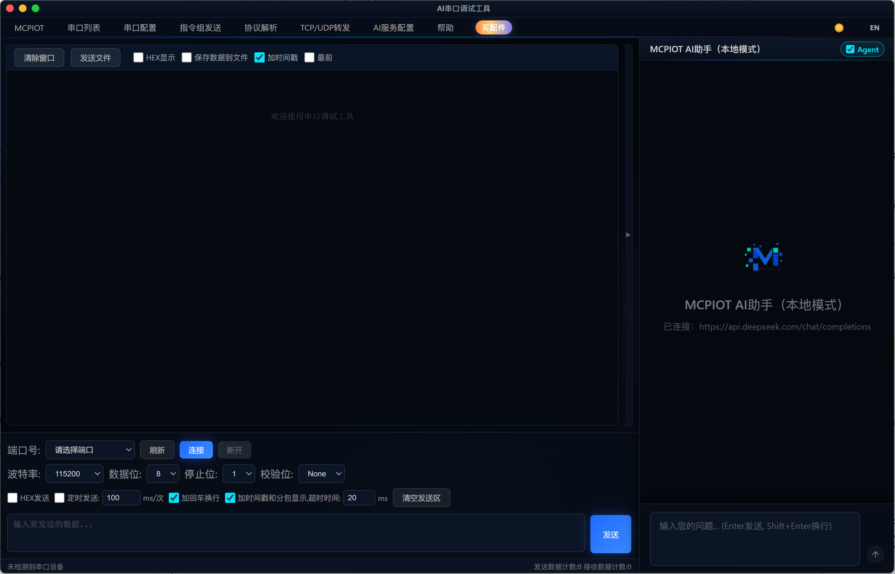

# AI 串口调试工具

> 基于 Electron 构建的新一代串口调试工具，融合 AI 智能助手、TCP/UDP 转发、协议帧解析等专业功能，界面采用 Lightcore Prism 设计语言，支持深色 / 浅色主题与中英文切换。

[](https://www.gnu.org/licenses/gpl-3.0)
[](https://github.com/)
[](https://www.electronjs.org/)
[](https://github.com/)

<p align="center">
  
</p>

---

## 功能特性

### 串口通信
- 自动检测并列出所有可用串口设备
- 支持波特率 300 ~ 2000000、数据位 5/6/7/8、停止位 1/1.5/2、校验位 None/Even/Odd/Mark/Space
- 连接 / 断开状态实时显示，操作直观

### 数据显示
- 文本 / HEX 双模式显示，可随时切换
- 每行数据可附加时间戳（格式：`[HH:MM:SS.mmm]`）
- 接收 / 发送行用颜色区分，错误行醒目标注
- 接收数据自动滚动，支持暂停滚动、一键清空
- 支持将接收数据实时保存到文件

### 数据发送
- 文本发送 / HEX 发送，可选择自动追加 CR、LF 或 CR+LF
- 定时发送：设定间隔（ms）和发送次数，自动循环
- 快捷键 `Ctrl+Enter` 直接发送

### 多指令组发送
- 动态添加多条发送指令，每条可单独设置延迟（ms）
- 支持顺序发送、循环发送
- 配置持久化，重启后自动恢复

### 协议帧解析
- 自定义帧头、帧尾、长度字段偏移 / 字节数
- 自动从接收缓冲区中提取完整帧并高亮显示
- 支持 HEX 模式帧解析

### TCP/UDP 转发
- **TCP 服务端**：监听指定端口，接受多个客户端连接，双向透明转发
- **TCP 客户端**：主动连接远端服务器，双向透明转发
- **UDP**：绑定本地端口，向指定远端地址 / 端口双向转发
- 转发状态实时显示

### AI 智能助手
- 内嵌 AI 对话面板，支持普通对话和 **Agent 模式**
- Agent 模式配备 15 项串口操作工具：读写串口、扫描端口、发送指令组、解析协议帧等
- 可对接任意兼容 OpenAI API 的本地或云端大模型（如 Ollama、ChatGPT、DeepSeek 等）
- 支持 MCP（Model Context Protocol）扩展工具调用
- 对话历史、工具调用过程完整可见

### 界面与体验
- Lightcore Prism 设计风格：玻璃拟态、棱镜渐变边框、动态光晕背景
- 深色 / 浅色主题一键切换，偏好持久化
- 中文 / English 界面一键切换，偏好持久化
- 无边框自定义标题栏，窗口置顶功能
- 内置使用手册（离线可用）
- 快捷跳转配件购买页

---

## 技术栈

| 模块 | 版本 |
|------|------|
| Electron | 28.x |
| SerialPort | 12.x |
| Vue 3 | CDN（AI 助手面板） |
| Node.js | 18+ 推荐 |
| electron-builder | 24.x |

---

## 快速开始

### 环境要求

- Node.js 18+
- npm 9+
- Windows 10/11 x64

### 安装依赖

```bash
npm install
```

> 首次安装时 `serialport` 需要编译原生模块，请确保已安装 [node-gyp 依赖](https://github.com/nodejs/node-gyp#on-windows)（Visual Studio Build Tools 或 windows-build-tools）。

### 开发模式运行

```bash
# 普通启动
npm start

# 开发模式（自动打开 DevTools）
npm run dev
```

### 打包发布

```bash
# 打包为安装包 + 便携版（Windows x64）
npm run build:win

# 仅打包为目录（调试用）
npm run build:win:dir
```

打包产物位于 `release/` 目录，包含：
- `串口调试工具 Setup x.x.x.exe` — NSIS 安装包
- `串口调试工具-x.x.x-portable.exe` — 便携版

---

## 使用说明

### 1. 串口连接

1. 点击菜单栏 **串口列表 → 刷新** 获取最新端口列表
2. 从下拉框选择目标端口
3. 打开 **串口配置** 设置波特率等参数（默认 115200-8-N-1）
4. 点击 **连接** 按钮

### 2. 发送数据

- 底部输入框输入内容，点击 **发送** 或按 `Ctrl+Enter`
- 勾选 **HEX发送** 可发送十六进制字节序列（如 `AA BB CC`）
- 勾选 **定时发送** 并设置间隔，实现自动周期发送

### 3. 多指令组发送

1. 点击菜单 **指令组发送** 打开面板
2. 点击 **+ 添加行** 输入指令内容和延迟时间
3. 点击 **发送全部** 按顺序逐条发送

### 4. 协议帧解析

1. 点击菜单 **协议解析** 打开配置面板
2. 填写帧头（HEX）、帧尾（HEX，可选）、长度字段位置与字节数
3. 开启解析后接收数据时自动提取完整帧

### 5. TCP/UDP 转发

1. 点击菜单 **TCP/UDP转发** 打开面板
2. 根据需要选择 TCP 服务端 / TCP 客户端 / UDP 模式
3. 填写端口 / 地址，点击启动，串口与网络数据将双向透传

### 6. AI 助手配置

1. 点击菜单 **AI服务配置**，填写以下信息：
   - API Base URL（如 `http://localhost:11434/v1`）
   - API Key（本地模型可填任意值）
   - 模型名称（如 `qwen2.5:7b`、`gpt-4o`）
2. 点击右侧 MCPIOT 图标展开 AI 助手面板
3. 可在普通对话和 **Agent 模式** 之间切换
   - Agent 模式下 AI 可直接操作串口，执行调试任务

---

## 目录结构

```
uart-go/
├── main.js            # Electron 主进程
├── index.html         # 主界面
├── renderer.js        # 主界面渲染进程逻辑
├── styles.css         # 主界面样式
├── i18n.js            # 主界面国际化
├── help.html          # 离线使用手册
├── fonts/             # 本地字体文件
├── AILocal/
│   ├── index.html     # AI 助手面板
│   ├── app.js         # AI 助手 Vue 应用
│   └── i18n.js        # AI 助手国际化
├── AI/                # 旧版 AI 面板（保留）
├── build/             # 构建资源（图标等）
├── release/           # 打包输出目录
└── package.json
```

---

## 常见问题

**Q: 串口无法连接，提示权限错误？**
A: 以管理员身份运行程序，或检查串口是否已被其他软件占用。

**Q: 安装 npm 依赖时报 node-gyp 错误？**
A: 运行 `npm install --global windows-build-tools`（需管理员权限）或安装 Visual Studio Build Tools，并确保 Python 环境正常。

**Q: AI 助手没有回复？**
A: 检查 API Base URL 是否可访问、模型名称是否正确、API Key 是否有效。本地 Ollama 确保服务已启动（`ollama serve`）。

**Q: TCP/UDP 转发无数据？**
A: 确认防火墙未拦截对应端口，服务端模式需确认客户端连接到了正确的 IP 和端口。

---

## 开源协议

本项目采用 [GNU General Public License v3.0](https://www.gnu.org/licenses/gpl-3.0) 开源协议。

```
UART Go — AI 串口调试工具
Copyright (C) 2025  MCPIOT

This program is free software: you can redistribute it and/or modify
it under the terms of the GNU General Public License as published by
the Free Software Foundation, either version 3 of the License, or
(at your option) any later version.

This program is distributed in the hope that it will be useful,
but WITHOUT ANY WARRANTY; without even the implied warranty of
MERCHANTABILITY or FITNESS FOR A PARTICULAR PURPOSE. See the
GNU General Public License for more details.

You should have received a copy of the GNU General Public License
along with this program. If not, see <https://www.gnu.org/licenses/>.
```

---

## 联系与购买配件

- 配件购买：[mcpiot.taobao.com](https://mcpiot.taobao.com)

<p align="center">
  
  &nbsp;&nbsp;&nbsp;&nbsp;
  
</p>
<p align="center">微信 &nbsp;&nbsp;&nbsp;&nbsp;&nbsp;&nbsp;&nbsp;&nbsp;&nbsp;&nbsp;&nbsp;&nbsp;&nbsp;&nbsp;&nbsp;&nbsp;&nbsp;&nbsp;&nbsp;&nbsp; WhatsApp</p>

---

*English documentation → [README.md](README.md)*
